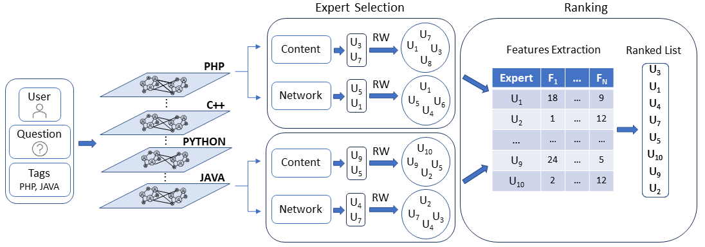

<div align="center">
  <h2>TUEF</h2>
  <h3>Topic-oriented User-interaction model for Expert Finding</h3>
</div>

___

### Introduction

In this paper, we address the Expert Finding (EF) task in Community Question&Answering (CQA) platforms, which aim is to identify and recognize community users with a high level of expertise to whom to forward posted questions by reducing the waiting time to receive an answer.
CQA platforms differ from conventional Social Networks, where user relationships and interactions are explicitly defined. Consequently, numerous studies have suggested solutions for the EF task that rely solely on textual information. Nevertheless, advancements in <i>Social Network Analysis</i> techniques favored identifying and modeling hidden user relationships, enhancing the performance of CQA services.
To fully exploit all the information a CQA platform can offer, this paper proposes TUEF, a <i>Topic-oriented, User-interaction model for EF</i>. TUEF jointly leverages <i>content</i> and <i>social</i> information available in the CQA by defining a topic-based Multi-Layer graph that represents CQA users' relationships based on their similarities in providing answers. TUEF blends these complementary sources of information (content and social relationships) to identify the most relevant and knowledgeable users for addressing the given question.
the Figure outlines the main building blocks of the proposed solution. TUEF first generates a Multi-Layer graph, where each layer corresponds to one of the main topics discussed in the community, where the topics are automatically extracted by analyzing tags of prior questions in the platform. In each layer, the nodes represent users actively participating in topic discussions, while edges model similarities and relationships among users under specific topics. At inference time, given a question $q$, the Multi-Layer graph $G$, and a ranking model $r$, TUEF first determines the main topics to which the question $q$ belongs and the corresponding graph layers. Next, for each layer, it selects the candidate experts from two perspectives: i) <i>Network</i>, by identifying central users that may have considerable influence within the community;
ii) <i>Content</i>, by identifying users who previously answered questions similar to $q$. In both cases, the graph is used to collect candidate experts through appropriate exploration policies. Then, TUEF extracts features based on text, tags, and graph relationships for the selected experts. Finally, it uses a learned, precision-oriented model $r$ to score the candidates and rank them by expected relevance.

This repository contains the Python code necessary to replicate the analysis conducted in our work on TUEF.

<div align="center">
  
</div>

___

### Environment Setup

TUEF is prototyped by Python 3.8.17. All experiments are conducted on an Intel(R) Xeon(R) Platinum 8164 CPU 2.00GHz processors with 503GB RAM on Linux 5.4.0-153-generic. 

To run TUEF correctly, it is necessary to create a conda environment that installs the libraries specified in the yml file.

To create and activate the environment, run the following commands:

```
$ conda env create -f environment.yml
$ conda activate tuef
$ pip install -r requirements.txt
```
___

### Data

Stack Exchange provides anonymized dump of all user-contributed content on the Stack Exchange network. Each site is formatted as a separate archive consisting of XML files zipped via 7-zip using bzip2 compression. Each site archive includes Posts, Users, Votes, Comments, PostHistory, and PostLinks.

We conducted experiments using a large-scale dataset from StackOverflow, the largest community within the Stack Exchange network. The StackOverflow data dump is publicly available <a href="https://archive.org/details/stackexchange">here</a>.

Given the large dataset size, we can not upload the necessary data to reproduce our results on GitHub. 
To replicate our study, download the dataset and unzip the `Posts` and `Users` 7z files into `./Dataset/SO/raw/` folder.

___

### Run

For both `TUEF` and `Baselines`, we made available the measures results and the rankers. For dimension problems, we can't upload all the data. 
To fully reproduce the study and execute `TUEF` from scratch, run the following command:

```
$ bash TUEF.sh
```

The `Baselines` can be computed after `TUEF` with the following command:

```
$ bash Baselines.sh
```

The `NerankBaseline` contains the adaptation of `TUEF` to the `Nerank` configuration problem. Given the smaller dimension of data, we made available the complete execution. 
To execute `NerankBaseline` from scratch, run the following command in the NerankBaseline folder:

```
$ bash NerankBaseline.sh
```